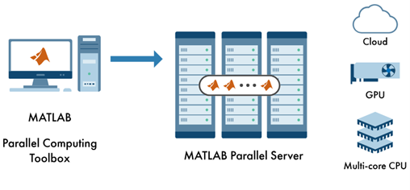
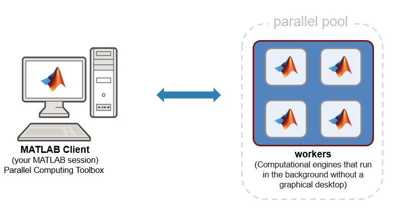
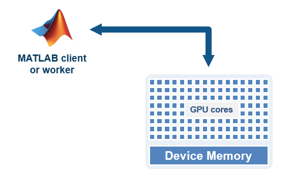

# Workshop: Parallel Computing with MATLAB

INSA Rennes \- June 13, 2025

Daniele Sportillo \- [dsportil@mathworks.com](mailto:dsportil@mathworks.com)

<!-- Begin Toc -->

## Table of Contents
 
[Workshop: Parallel Computing with MATLAB \- Part I](#T_690b)
 
&emsp;[Introduction to the Workshop environment](#TMP_937a)
 
&emsp;[Explicit Parallel Computing with MATLAB on your multicore CPU](#H_524a)
 
&emsp;&emsp;[Parallel Pool of MATLAB Workers](#H_5d31)
 
&emsp;&emsp;[Parallel for loops: `parfor`](#H_903F4D17)
 
&emsp;&emsp;[**Run functions in the background with** **`parfeval`**](#H_3d60)
 
&emsp;&emsp;[Run Single Programs on Multiple Data Sets **with** **`spmd`**](#H_7059C066)
 
&emsp;[Leverage NVIDIA GPUs without learning CUDA](#H_1f1a)
 
&emsp;[Offload serial and parallel computations to a remote cluster or cloud](#H_891b)
 
&emsp;[Need help?](#H_42a9)
 
&emsp;[New to MATLAB or Simulink?](#TMP_7306)
 
<!-- End Toc -->

# Introduction to the Workshop environment

0) [**Introduction to the Workshop Environment**](./Ex0_introductionWorkshopEnvironment.mlx): Familiarize with the editor and environment that you'll use to solve hands\-on problems throughout the workshop.

# Explicit Parallel Computing with MATLAB on your multicore CPU

In this section you will  learn how to use different  high\-level parallel programming constructs to distribute tasks leveraging your multicore workstation. 

## Parallel Pool of MATLAB Workers

 **1)** [**Parpool Introduction**](./Ex1_parpool_intro.mlx) **:** Learn how to start up and shut down parallel pool of MATLAB workers on your MATLAB session. 

## Parallel for loops: `parfor` 

Learn how to distribute independent tasks among different MATLAB workers using parallel for loops. 

 **2)** [**Parfor getting started**](./Ex2_parfor_getting_started.mlx) **:** Convert a simple  `for` loop into a  `parfor` loop and understand the basic differences between the two types of loops

 **3)** [**Parfor conversions**](./Ex3_parfor_conversions.mlx) **:** Diagnose and fix issues you may run into when rewriting a for loop to a  `parfor` loop

 **4)** [**Using parfor for parallel Monte\-Carlo Simulations**](./Ex4_parforlMonteCarloPi.mlx) **:** Use `parfor` to speed\-up a Monte\-Carlo simulation to calculate pi

##  **Run functions in the background with** **`parfeval`**

Learn how to run functions in the background using `parfeval`. Unlike `parfor` loops, `parfeval` allows you to continue executing commands in MATLAB while the parallel work completes in the background (<u>asynchronous execution</u>). 

 **5)** [**Getting Started with parfeval**](./Ex5_parfeval_getting_started.mlx) **:** Learn how to run a single function in the background on an available MATLAB worker and how to fetch back results into the main MATLAB session

 **6)** [**Create an array of functions scheduled to run in the background**](./Ex6_parfeval_FutureArray.mlx) **:** Learn how to use parfeval to create an array of functions (queue) scheduled to run in the background as soon as a worker becomes available

## Run Single Programs on Multiple Data Sets **with** **`spmd`**

 **7)** [**Tall Arrays for Out\-of\-Memory Data**](./Ex7_Tall_Example.mlx) **:** Tall arrays are used to work with out\-of\-memory data that is backed by a `datastore`

 **8)** [**SPMD**](./Ex8_spmd_Example.mlx) **:** Execute code in parallel on workers of parallel pool

# Leverage NVIDIA GPUs without learning CUDA

In this section, you'll learn how to use Parallel Computing Toolbox to speed up your code by running MATLAB functions on a GPU. 

 **9)** [ **Getting Started with GPU Computing in MATLAB:** ](./Ex9_gpus_getting_started.mlx)Learn how to speed up computations using your computer's NVIDIA GPU with MATLAB built\-in functions on data stored as `gpuArray`

*You can further accelerate your code using advanced GPU CUDA and MEX programming. You can learn more by consulting product documentation and technical support.*

# Offload serial and parallel computations to a remote cluster or cloud

You can use batch jobs to offload the execution of long\-running computations to the background, allowing you to carry out other tasks while the batch job is processing. Jobs can be offloaded to a **remote on\-premise HPC cluster or to public/private clouds.**

 **10)** [**Getting started with batch**](./Ex10_batch_getting_started.mlx) **:** Learn how to offload work from MATLAB to your local or a remote machine. This workflow can be used to submit jobs to a remote compute cluster or the cloud, freeing up your local resources

# Need help?

  [Parallel Computing Toolbox Documentation](https://www.mathworks.com/help/parallel-computing/)

 [Parallel Computing Toolbox Examples](https://www.mathworks.com/help/parallel-computing/examples.html?s_tid=CRUX_topnav)

 Contact [MathWorks Support](https://www.mathworks.com/support/contact_us.html)

# New to MATLAB or Simulink? 

Free online courses: 

|||
| :-: | :-: |
| [**MATLAB Onramp**](https://matlabacademy.mathworks.com/details/matlab-onramp/gettingstarted)       | [**Simulink Onramp**](https://matlabacademy.mathworks.com/details/simulink-onramp/simulink)        |

